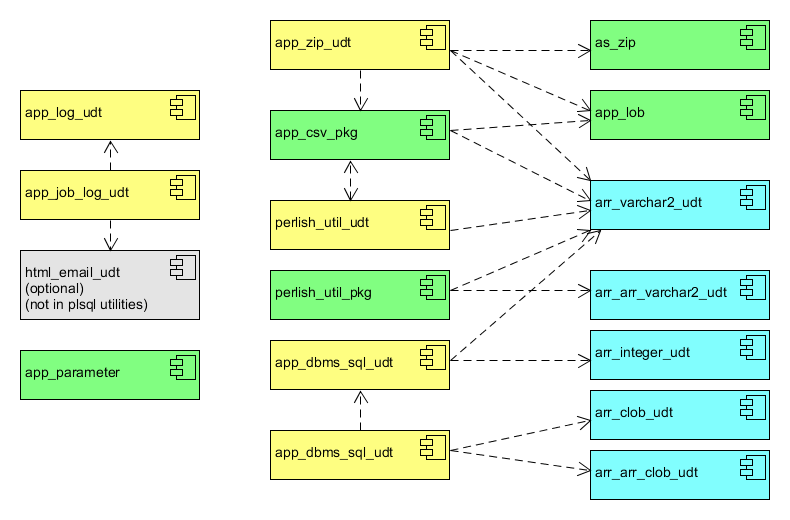

# plsql_utilities

An Oracle PL/SQL Utility Library

Feel free to pick and choose, or just borrow code. Some of them you should keep my copyright
per the MIT license, others are already public domain. Included are

* Application Logging
* Application Parameter Facility
* Perlish Utility User Defined Type
    * Transforming Perl-style Regexp to Oracle RE
    * methods that mimic the Perl *map*, *join* and *sort* methods in a chain of calls
* CSV data handling
* Create Zoned Decimal Strings from Numbers
* A few LOB Utilities
* A zip archive handler courtesy of Anton Scheffer
* An Object wrapper for *as_zip*
* A wrapper for DBMS_SQL that handles bulk fetches (likely superceded by Polymorphic Table Functions)

# Content

1. [install.sql](#installsql)
2. [Packages and Types](#packages-and-types)

## install.sql

*install.sql* runs each of these scripts in correct order.

There are sqlplus *define* statements at the top of the script for naming basic collection types.
In this document I refer to them with **arr\_X\_udt** names, but you can follow your own naming guidelines
for them. If you already have types with the same characteristics, put those into the *define* statements
and then set the corresponding **compile\*** define values to FALSE.

Dependencies are depicted in the component diagram, but repeated here.

*perlish_util_pkg* depends on *arr_varchar2_udt* and *arr_arr_varchar2_udt*.

*perlish_util_udt* depends on *arr_varchar2_udt* and *app_csv_pkg*.

*app_csv_pkg* depends on *perlish_util_udt*, *app_lob* and *arr_varchar2_udt*. Much of the functionality also requires Oracle verision 18 or higher.

*app_zip* depends on *as_zip*, *app_lob*, *arr_varchar2_udt*, and *app_csv_pkg*.

*app_job_log* depends on *app_log*, and optionally on [html_email](https://github.com/lee-lindley/html_email)
if you set the compile directive define use_html_email to 'TRUE' in *app_job_log/install_app_job_log.sql*.

Other than those, you can compile these separately or not at all. If you run *install.sql*
as is, it will install 10 of the 11 components (and sub-components).

The compile for *app_dbms_sql* is set to FALSE. It is generally compiled from a repository
that includes *plsql_utilities* as a submodule. It requires *arr_arr_clob_udt*, *arr_clob_udt*, *arr_integer_udt*, and *arr_varchar2_udt*.

## Packages and Types

|  |
|:--:|
| Plsql Utilities Component Diagram |

Each component has a separate directory and README.md file.

- [app_csv_pkg](app_csv_pkg/)
    - Create CSV Rows from an Oracle query
    - Split CSV Record into Collection of Fields
    - Read from a CSV CLOB as a Table of Records
    - Create a Private Temporary (PTT) Table from a CSV CLOB
    - Generate a DML Deployment Script from Table data
- [app_lob](app_lob/)
    - Function that splits a CLOB into a set of concatenated quoted literals for including in code.
    - Procedures that write BLOB/CLOB to a file in a database directory object
    - Functions that return a BLOB/CLOB from a database directory file
    - Function that converts a CLOB to a BLOB
- [app_log](app_log/)
    - write log message to database table
    - maintain application log keys
    - purge old log records
    - provide analytical views on log records
- [app_job_log](app_job_log/)
    - mark start and end of a batch job
    - report errors in standardized format
    - optionally send email on job failure and/or success
- [app_parameter](app_parameter/)
    - *set* parameter values
    - *get* parameter values
    - *end* parameter values
    - methods for distinguishing between production and non-production instances
- [app_types](app_types/)
    - base collection types
- [perlish_util](perlish_util/)
    - Transform regular expression string from Perl Extended format to Oracle regex string
    - map a string transformation onto list elements
    - join string elements into single string with separator
    - sort
    - get
    - combine elements of two lists into new list
- [to_zoned_decimal](misc/)
    - get zoned decimal string representation of number
- [as_zip](as_zip/)
    - Anton Scheffer ZIP archive package
- [app_zip](app_zip/)
    - add BLOB to zip
    - add CLOB to zip
    - add 1 or more files to zip from Database Directory Object(s)
    - get finished zip BLOB
- [app_dbms_sql](app_dbms_sql/)
    - Bulk collect query results into collections of string collections
