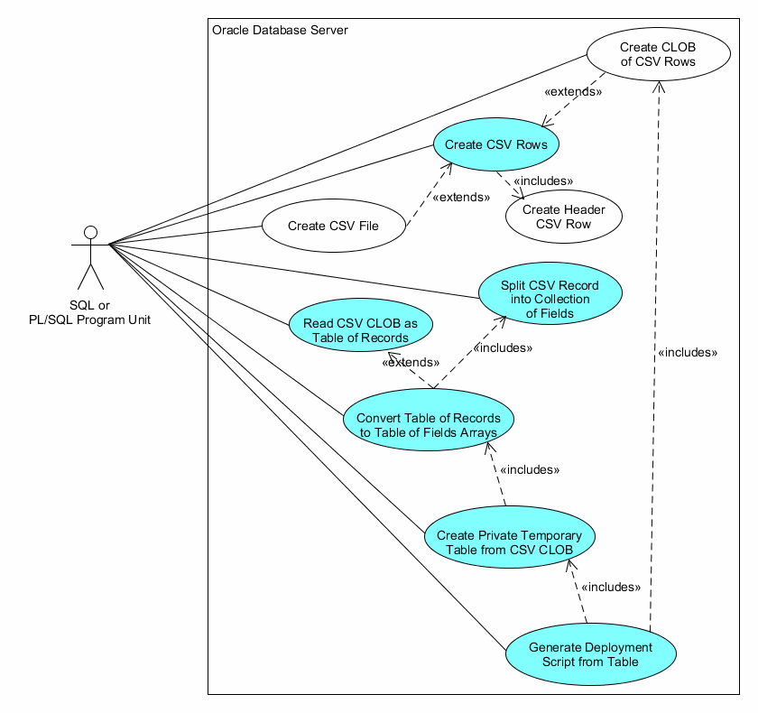

# app_csv_pkg

*app_csv_pkg* provides methods for dealing with Comma Separated Value (CSV) data.

- Create CSV Rows, File or CLOB from an Oracle query.
- Split CSV Record into Collection of Fields
- Read from a CSV CLOB as a Table of Records or Table of Fields Arrays
- Create a Private Temporary (PTT) Table from a CSV CLOB
- Generate a DML Deployment Script from Table data

A CSV row will have the separator between each field
(can be any separator character, but comma (',') and pipe ('|') are most common).
There is no separator after the last field (which
would make it a delimited file rather than separated).

If a field contains the separator
character or newline, then the field value is enclosed in double quotes. In that case, if the field 
also contains double quotes, then those are doubled up 
per [RFC4180](https://www.loc.gov/preservation/digital/formats/fdd/fdd000323.shtml).

The resulting set of strings (rows) can be written to a file, collected into a CLOB, or selected from 
a Polymorphic Table Function. Likewise, methods can consume a multi-line CLOB or records that follow the CSV rules.

> NOTE: Many of the methods
require Oracle version 18c or higher as they depend on a Polymorphic Table Function. 
If you are on an earlier version, *split_csv*, *split_clob_to_lines*, and *split_lines_to_fields* methods will compile,
but the rest will be left out.
I have another github repository [app_csv_udt](https://github.com/lee-lindley/app_csv) 
that should run on Oracle 10g or better, has a few more options, and an Object Oriented
interface I prefer. I've found many people are less comfortable with the Object Oriented interface.
This is also simpler in many respects. Unfortunately, there is no way around the lack of Private Temporary
Tables in earlier versions.

> ADDENDUM: There is a substantial limitation of Polymorphic Table Functions at least as of 19.6 and 20.3 (may
have been addressed in later releases) that may make
[app_csv_udt](https://github.com/lee-lindley/app_csv) a better choice. Only SCALAR
values are allowed for columns, which sounds innocuous enough, until you understand that
SYSDATE and TO_DATE('20210101','YYYYMMDD') do not fit that definition for reasons I cannot fathom.
If you have those in your cursor/query/view, you must cast them to DATE for it to work. More detail follows
at the bottom of this document.

# Content

- [Use Cases](#use-cases)
    - [Create CSV Rows](#create-csv-rows)
    - [Create CLOB of CSV Rows](#create-clob-of-csv-rows)
    - [Create CSV File](#create-csv-file)
    - [Split CSV Record into Collection of Fields](#split-csv-record-into-collection-of-fields)
    - [Read CSV CLOB as Table of Records](#read-csv-clob-as-table-of-records)
    - [Convert Table of Records to Table of Fields Arrays](#convert-table-of-records-to-table-of-fields-arrays)
    - [Create Private Temporary Table from CSV CLOB](#create-private-temporary-table-from-csv-clob)
    - [Generate Deployment Script from Table](#generate-deployment-script-from-table)
- [Manual Page](#manual-page)
    - [splti_csv](#split_csv)
    - [split_clob_to_lines](#split_clob_to_lines)
    - [split_lines_to_fields](#split_lines_to_fields)
    - [create_ptt_csv](#create_ptt_csv)
    - [gen_deploy_insert](#gen_deploy_insert)
    - [gen_deploy_merge](#gen_deploy_merge)
    - [ptf](#ptf)
    - [get_ptf_query_string](#get_ptf_query_string)
    - [get_clob](#get_clob-a)
    - [write_file](#write_file-a)
- [Examples](#examples)
- [Issue with PTF and DATE Functions](#issue-with-ptf-and-date-functions)


# Use Cases

|  |
|:--:|
| app_csv_pkg Use Case Diagram |

## Create CSV Rows

You can use a SQL SELECT to read CSV strings as records from the Polymorphic Table Function *app_csv_pkg.ptf*, perhaps
spooling them to a text file with sqlplus. Given how frequently I've seen a cobbled together
SELECT concatenting multiple fields and separators into one value, this may
be the most common use case. Use of the *WITH* clause is pretty much required for Polymorphic Table Functions (although
you can provide an actual schema level table or view name instead, you probably won't).

```sql
set echo off
set linesize 300
set pagesize 0
set heading off
set trimspool on
set feedback off
spool test.csv

WITH R AS (
    SELECT last_name||', '||first_name AS "Employee Name", hire_date AS "Hire Date", employee_id AS "Employee ID"
    FROM hr.employees
    --ORDER BY last_name, first_name
) SELECT *
FROM app_csv_pkg.ptf(R, p_date_format => 'YYYYMMDD')
;
spool off
```
Sample Output:

    "Employee Name","Hire Date","Employee ID"
    "Abel, Ellen","20040511",174
    "Ande, Sundar","20080324",166
    "Atkinson, Mozhe","20051030",130

## Create CLOB of CSV Rows

The CSV strings can be concatenated into a CLOB with linefeed (or CR/LF) after each row. The resulting CLOB can be
attached to an e-mail, written to a file or inserted/updated to a CLOB column in a table. Perhaps
added to a zip archive. There are many possibilites once you have the CSV content in a CLOB.

```sql
    DECLARE
        l_clob  CLOB;
    BEGIN
        l_clob := app_csv_pkg.get_clob(
            p_protect_numstr_from_excel => 'Y'
            ,p_sql => q'!
SELECT department_id, department_name, manager_id, TO_CHAR(location_id,'0999999') AS location_id
FROM hr.departments 
ORDER BY department_name!'
        );
        ...
    END;
    
    -- or --
SELECT app_csv_pkg.get_clob(
            p_protect_numstr_from_excel => 'Y'
            ,p_sql => q'!
SELECT department_id, department_name, manager_id, TO_CHAR(location_id,'0999999') AS location_id
FROM hr.departments 
ORDER BY department_name!'
        )
FROM dual;
```

## Create CSV File

Produce a CSV file on the Oracle server in a directory to which you have write access. Presumably
you have a process that can then access the file, perhaps sending it to a vendor. *test/test3.sql*
is a contrived example of writing the file, then using TO_CLOB(BFILENAME()) to retrieve it in a SQL statement.

```sql
DECLARE
    v_src   SYS_REFCURSOR;
BEGIN
    OPEN v_src FOR WITH R AS (
        SELECT TO_CHAR(employee_id) AS "Emp ID", last_name||', '||first_name AS "Fname", hire_date AS "Date,Hire,YYYYMMDD", salary AS "Salary"
        from hr.employees
        UNION ALL
        SELECT '999' AS "Emp ID", '  Baggins, Bilbo "badboy" ' AS "Fname", TO_DATE('19991231','YYYYMMDD') AS "Date,Hire,YYYYMMDD", 123.45 AS "Salary"
        FROM dual
      ) 
        SELECT *
        FROM app_csv_pkg.ptf(R ORDER BY "Fname"
                                ,p_num_format   => '$999,999.99'
                                ,p_date_format  => 'YYYYMMDD'
                            )

    ;
    app_csv_pkg.write_file(p_dir => 'TMP_DIR', p_file_name => 'x.csv', p_src => v_src);
END;
/

set echo off
set linesize 200
set pagesize 0
set heading off
set trimspool on
set feedback off
set long 90000
set serveroutput on
spool test3.csv
SELECT TO_CLOB(BFILENAME('TMP_DIR','x.csv')) FROM dual
;
spool off
```
You could just as easily have put the TO_CHAR conversions in your SELECT list, and in fact you should
do so if you want *p_protect_numstr_from_excel* to evaluate your converted string text. The builtin
conversions bypass that check.

Sample Output:

    "Emp ID","Fname","Date,Hire,YYYYMMDD","Salary"
    "999","  Baggins, Bilbo ""badboy"" ","19991231","     $123.45"
    "174","Abel, Ellen","20040511","  $11,000.00"
    "166","Ande, Sundar","20080324","   $6,400.00"

## Split CSV Record into Collection of Fields

Convert a string containing a CSV record into an array of field values strings.

```sql
SELECT *
FROM app_csv_pkg.split_csv('"Emp ID","Fname","Date,Hire,YYYYMMDD","Salary"');
```
    Emp ID
    Fname
    Date,Hire,YYYYMMDD
    Salary

```sql
DECLARE
    v_arr arr_varchar2_udt := app_csv_pkg.split_csv('"Emp ID","Fname","Date,Hire,YYYYMMDD","Salary"');
BEGIN
    FOR i IN 1..v_arr.COUNT
    LOOP
        DBMS_OUTPUT.put_line( v_arr(i) );
    END LOOP;
END;
```

## Read CSV CLOB as Table of Records

Split a CLOB containing CSV records separated by linefeed into an array
of records. This is implemented as a pipelined table function.

```sql
SELECT t.s AS line 
FROM TABLE(APP_CSV_PKG.split_clob_to_lines(q'["abc",123,xyz
def,456,"embedded
newline"
lmn,789,opq]'
     )
) t
ORDER BY t.rn
;
```
Because the data contains double quotes and an embedded newline, it is difficult to convey the result.
This JSON representation seems to capture the detail.
```json
{
  "results" : [
    {
      "columns" : [
        {
          "name" : "RN",
          "type" : "NUMBER"
        },
        {
          "name" : "LINE",
          "type" : "VARCHAR2"
        }
      ],
      "items" : [
        {
          "rn" : 1,
          "line" : "\"abc\",123,xyz"
        },
        {
          "rn" : 2,
          "line" : "def,456,\"embedded\nnewline\""
        },
        {
          "rn" : 3,
          "line" : "lmn,789,opq"
        }
      ]
    }
  ]
}
```

## Convert Table of Records to Table of Fields Arrays

If you are working inside PL/SQL, then you can call *split_csv* to parse a record returned from *split_clob_to_lines*.
You can also do that in SQL, but will incur context switch costs that can be significant. The pipelined table function
*split_lines_to_fields* is passed a cursor expected to provide CSV line rows as are produced by *split_clob_to_lines*.
The most efficient way to call it is as a chained pipeline table construct directly in SQL:

```sql
    SELECT t.arr 
    FROM TABLE(
                app_csv_pkg.split_lines_to_fields(
                    CURSOR(SELECT * 
                           FROM TABLE( app_csv_pkg.split_clob_to_lines(:p_clob, p_skip_lines => 1) )
                    )
                    , p_separator => :p_separator, p_strip_dquote => :p_strip_dquote, p_keep_nulls => 'Y'
                )
    ) t
```

This gives you records containing a collection of strings. From there you can construct a *perlish_util_udt*
object or deal with the fields directly as in this example:

```sql
WITH FUNCTION wget(
    p_arr   ARR_VARCHAR2_UDT
    ,p_i    NUMBER
) RETURN VARCHAR2
AS
BEGIN
    RETURN p_arr(p_i);
END;
a AS (
    SELECT t.arr 
    FROM TABLE(
                app_csv_pkg.split_lines_to_fields(
                    CURSOR(SELECT * 
                           FROM TABLE( app_csv_pkg.split_clob_to_lines(:p_clob, p_skip_lines => 1) )
                    )
                    , p_separator => :p_separator, p_strip_dquote => :p_strip_dquote, p_keep_nulls => 'Y'
                )
    ) t
) SELECT 
     get(a.arr, 1) AS "Employee ID"
    ,get(a.arr, 2) AS "Last Name"
    ,get(a.arr, 3) AS "First Name"
    ,get(a.arr, 4) AS "nickname"
FROM a
;
/
```

## Create Private Temporary Table from CSV CLOB

Given a CLOB that contains CSV records separated by linefeeds with the first
record containing column names, create a private temporary table with those
column names and populate it from the remaining records in the CLOB.

```sql
BEGIN
    APP_CSV_PKG.create_ptt_csv('firstcol, secondcol, thirdcol
1, 2, 3
4, 5, 6');
END;
/
SELECT * FROM ora$ptt_csv
;
```
    "firstcol"	"secondcol"	"thirdcol"
    "1"	"2"	"3"
    "4"	"5"	"6"

Or in JSON to make it clear what you are getting:

```json
	{
	  "results" : [
	    {
	      "columns" : [
	        {
	          "name" : "firstcol",
	          "type" : "VARCHAR2"
	        },
	        {
	          "name" : "secondcol",
	          "type" : "VARCHAR2"
	        },
	        {
	          "name" : "thirdcol",
	          "type" : "VARCHAR2"
	        }
	      ],
	      "items" : [
	        {
	          "firstcol" : "1",
	          "secondcol" : "2",
	          "thirdcol" : "3"
	        },
	        {
	          "firstcol" : "4",
	          "secondcol" : "5",
	          "thirdcol" : "6"
	        }
	      ]
	    }
	  ]
	}
```
In case it wasn't obvious, notice that the column names in the example are lower case.

## Generate Deployment Script from Table

Read the data from a table (with an optional WHERE clause) and convert it
into a CSV CLOB with a header row. Break the CLOB into a set of quoted
string literals. Generate a script that

1. Creates a Private Temporary Table from the CLOB (input as contactenated string literals).
2. Inserts or Merges records from the PTT into the target Table

```sql
SELECT APP_CSV_PKG.gen_deploy_merge(
    p_table_name    => 'MY_TABLE_NAME'
    ,p_key_cols     => 'ID'
    ,p_where_clause => 'id <= 10'
) FROM DUAL;
```

That provides the following script as a CLOB in your query result. Note that
if the size of the CSV CLOB holding the records was greater than 32767, 
it would be represented by a concatenated set of quoted literals instead
of just one as shown here.

```sql
BEGIN
    APP_CSV_PKG.create_ptt_csv(TO_CLOB(q'{"ID","MSG","DT"
1,"testing...","03/26/2022"
2,"testing...","03/27/2022"
3,"testing...","03/28/2022"
4,"testing...","03/29/2022"
5,"testing...","03/30/2022"
6,"testing...","03/31/2022"
7,"testing...","04/01/2022"
8,"testing...","04/02/2022"
9,"testing...","04/03/2022"
10,"testing...","04/04/2022"
}')
);
END;
/
MERGE INTO MY_TABLE_NAME t
USING (
    SELECT *
    FROM ora$ptt_csv
) q
ON (
    t."ID" = q."ID"
)
WHEN MATCHED THEN UPDATE SET
    t."MSG" = q."MSG"
    ,t."DT" = q."DT"
WHEN NOT MATCHED THEN INSERT(
    "ID", "MSG", "DT"
) VALUES (
    q."ID", q."MSG", q."DT"
);
COMMIT;
```

# Manual Page

## split_csv

```sql
    FUNCTION split_csv (
	     p_s            CLOB
	    ,p_separator    VARCHAR2    DEFAULT ','
	    ,p_keep_nulls   VARCHAR2    DEFAULT 'N'
	    ,p_strip_dquote VARCHAR2    DEFAULT 'Y' -- also unquotes \" and "" pairs within the field to just "
    ) RETURN &&d_arr_varchar2_udt. 
    DETERMINISTIC;
```
- *p_s*
    - A string containing a CSV record
- *p_separator*
    - The character (well, you could use a multi-character separator, but don't) between fields. Usually comma, but pipe is common as well.
- *p_keep_nulls*
    - Whether or not to put a NULL value into the returned array when an empty field is encountered.
- *p_strip_dquote*
    - CSV fields may be enclosed in double quotes. The default behavior is to "de-quote" the string.

A function to split a comma separated value string that follows RFC4180 
into an array of strings.

Treat input string *p_s* as following the Comma Separated Values (csv) format 
(not delimited, but separated) and break it into an array of strings (fields) 
returned to the caller. This is overkill for the most common case
of simple separated strings that do not contain the separator char and are 
not quoted, but if they are double quoted fields, this will handle them 
appropriately including the quoting of " within the field.

We comply with RFC4180 on CSV format (for what it is worth) while also 
handling the mentioned common variants like backwacked quotes and 
backwacked separators in non-double quoted fields.

See [CSV Specification/RFC](https://www.loc.gov/preservation/digital/formats/fdd/fdd000323.shtml).

The problem turned out to be much more complex than I thought when starting the work.
If you like playing with regular expressions, take a gander and tell me if you can 
do better. (really! I like to learn.)

## split_clob_to_lines

```sql
    -- public type to be returned by split_clob_to_lines PIPE ROW function
    TYPE t_csv_row_rec IS RECORD(
        s   VARCHAR2(4000)  -- the csv row
        ,rn NUMBER          -- line number in the input
    );
    TYPE t_arr_csv_row_rec IS TABLE OF t_csv_row_rec;
    --
    -- split a clob into a row for each line.
    -- Handle case where a "line" can have embedded LF chars per RFC for CSV format
    -- Throw out completely blank lines (but keep track of line number)
    --
    FUNCTION split_clob_to_lines(
        p_clob          CLOB
        ,p_max_lines    NUMBER DEFAULT NULL
        ,p_skip_lines   NUMBER DEFAULT NULL
    )
    RETURN t_arr_csv_row_rec
    PIPELINED;
```

- *p_clob*
    - A string containing CSV records separated by linefeed
- *p_max_lines*
    - Stop after reading a number of lines. Most common use case is stop after reading the first line (header row).
- *p_skip_lines*
    - Skip a number of lines before producing output rows. Most common use case is skipping the first line (header row).

The input CLOB is expected to have zero or more lines separated by newline (CHR(10)). If you have 
Carriage Returns (CHR(13)) they are included in the resulting rows in the collection, but it is whitespace
and probably won't matter.

The lines can be CSV records meaning they can have double quoted strings that even include newlines.
It will figure them out. The idea is you can have a CLOB like so:

    "abc",123,xyz
    def,456,"ghi"
    lmn,789,opq

and pull the lines out like so:

```sql
SELECT t.rn AS line_number, t.s AS line 
FROM TABLE(APP_CSV_PKG.split_clob_to_lines(q'["abc",123,xyz
def,456,"ghi"
lmn,789,opq]'
     )
) t
ORDER BY t.rn;
```

The *rn* field is the input line number. Although the implementation may deliver the rows
in the same order they appear in the CLOB, Oracle does not guarantee the order unless you specify an "ORDER BY"
clause. If you need to preserve the order of the lines in the CLOB, you can count on luck or you
can specify it. I'll remind you that Oracle has changed the underlying default order before when they 
switched "DISTINCT" to use a hash rather than a sort, so not a good idea to depend on the implementation
for the order even if it works today. Most of the time you probably will not care about preserving the order.

## split_lines_to_fields

```sql
    -- public type to be returned by split_clob_to_lines PIPE ROW function
    TYPE t_csv_row_rec IS RECORD(
        s   VARCHAR2(4000)  -- the csv row
        ,rn NUMBER          -- line number in the input
    );
    TYPE t_arr_csv_row_rec IS TABLE OF t_csv_row_rec;
    TYPE t_curs_csv_row_rec IS REF CURSOR RETURN t_csv_row_rec;

    TYPE t_csv_fields_rec IS RECORD(
        arr ARR_VARCHAR2_UDT
        ,rn NUMBER
    );
    TYPE t_arr_csv_fields_rec IS TABLE OF t_csv_fields_rec;

    FUNCTION split_lines_to_fields(
        p_curs          t_curs_csv_row_rec
        ,p_separator    VARCHAR2    DEFAULT ','
	    ,p_strip_dquote VARCHAR2    DEFAULT 'Y' -- also unquotes \" and "" pairs within the field to just "
        ,p_keep_nulls   VARCHAR2    DEFAULT 'Y'
    ) 
    RETURN t_arr_csv_fields_rec
    PIPELINED
    ;
```

- *p_curs*
    - A strongly typed REF CURSOR expected to return rows containing fields named *s* and *rn* for the CSV string and row_number respectively (as is returned by *split_clob_to_lines*).
- *p_separator*
    - A parameter passed to *split_csv* to parse the row
- *p_strip_dquote*
    - A parameter passed to *split_csv* to parse the row
- *p_keep_nulls*
    - A parameter passed to *split_csv* to parse the row

See the use case [Convert Table of Records to Table of Fields Arrays](#convert-table-of-records-to-table-of-fields-arrays)
for an example of using *split_lines_to_fields* as a chained pipeline row construct with *split_clob_to_lines*.

## create_ptt_csv

> *create_ptt_csv* requires the calling account to have **CREATE TABLE** privilege. You can create
> a wrapper package or procedure compiled in a schema that has **CREATE TABLE** granted directly (not through
> a role) if necessary to support accounts without **CREATE TABLE**.

```sql
    PROCEDURE create_ptt_csv (
         -- creates private temporary table "ora$ptt_csv" with columns named in first row of data case preserved.
         -- All fields are varchar2(4000)
	     p_clob         CLOB
	    ,p_separator    VARCHAR2    DEFAULT ','
	    ,p_strip_dquote VARCHAR2    DEFAULT 'Y' -- also unquotes \" and "" pairs within the field to just "
    );
```

- *p_clob*
    - Expected to contain at least one CSV line containing a header row of column names. Case matters. 
- *p_separator*
    - The CSV separator character. Although ',' is the most common, '|' is also prevalent.
- *p_strip_dquote*
    - "De-quote" the field values per RFC rules

*create_ptt_csv* carries the combination of *split_clob_to_lines* and *split_csv* to the next level.

The data in *p_clob* is expected to be newline delimited or separated with each line/row containing CSV data. The first row
is expected to contain column names. They must follow Oracle rules for column names. Regardless of your
setting of *p_strip_dquote* for the rest of the data, the column name row is parsed with *p_strip_dquote* set
to 'Y', then the resulting names are enclosed with double quotes. This means your names will have case preserved
and may contain spaces when the PTT is created. You cannot have NULL values in the header row.

These column names are used to construct an Oracle PRIVATE TEMPORARY TABLE named **ora$ptt_csv** 
that exists until

- your transaction commits or
- you call *create_ptt_csv* again which drops the PTT before creating it

All fields in the PTT are VARCHAR2(4000).

The data from the rest of the rows/lines after the header row
is loaded into these columns. If all of your lines do not have at least as many fields 
as there are column names in the first record,
*create_ptt_csv* will fail on the insert. You may have NULL values in the data (represented by ,,).

> Quoted literals are maximum length 32767 (unless you are doing some non-standard things with your database).
> If the CLOB you want to pass into the procedure is larger than that, and you need to represent it as a quoted
> literal, you can break it into pieces and use the concatenation operator **||** between them. You can of
> course do this manually or with a script; however, if your source data for the CLOB is in the database,
> you can use the [app_lob](../app_lob) function *clobtoliterals* to produce the construct you need. 
> My use case for all of this uses [app_csv_udt](../../app_csv_udt) or [app_csv_pkg](#app_csv_pkg) *get_clob*
> function to produce CSV rows in a CLOB, then split it into quoted literals with *app_lob.clobtoliterals*.
> The resulting text can then be passed as a CLOB argument to *create_ptt_csv*. Once that procedure is executed
> in an anonymous block, we have our data in *ora$ptt_csv* and can use it to execute our deployment
> process objective (likely loading to an existing production table with INSERT or MERGE).

- Example of *clobtoliterals*:
    ```sql
    SELECT app_lob.clobtoliterals(
                app_csv_pkg.get_clob(
                    p_sql => q'!
                        WITH a AS (
                            SELECT 
                                level AS id, CAST(TRUNC(SYSDATE) AS DATE) AS "Create Date", 'dummy text to pad it out' AS val
                            FROM dual
                            CONNECT BY level <= 1500
                        ) SELECT *
                        FROM a
                        ORDER BY id
                    !'
                )
                ,'Y'
           )
    FROM dual;
    ```
    - Results (3 concatenated quoted literal strings the last portion shown here):
    ```sql
    TO_CLOB(q'{"ID","Create Date","VAL"
    ...
    1479,"03/26/2022","dummy text to pad it out"
    }')
    ||TO_CLOB(q'{1480,"03/26/2022","dummy text to pad it out"
    1481,"03/26/2022","dummy text to pad it out"
    1482,"03/26/2022","dummy text to pad it out"
    1483,"03/26/2022","dummy text to pad it out"
    1484,"03/26/2022","dummy text to pad it out"
    1485,"03/26/2022","dummy text to pad it out"
    1486,"03/26/2022","dummy text to pad it out"
    1487,"03/26/2022","dummy text to pad it out"
    1488,"03/26/2022","dummy text to pad it out"
    1489,"03/26/2022","dummy text to pad it out"
    1490,"03/26/2022","dummy text to pad it out"
    1491,"03/26/2022","dummy text to pad it out"
    1492,"03/26/2022","dummy text to pad it out"
    1493,"03/26/2022","dummy text to pad it out"
    1494,"03/26/2022","dummy text to pad it out"
    1495,"03/26/2022","dummy text to pad it out"
    1496,"03/26/2022","dummy text to pad it out"
    1497,"03/26/2022","dummy text to pad it out"
    1498,"03/26/2022","dummy text to pad it out"
    1499,"03/26/2022","dummy text to pad it out"
    1500,"03/26/2022","dummy text to pad it out"
    }')
    ```

The use case [Create Private Temporary Table from CSV CLOB](#create-private-temporary-table-from-csv-clob)
provides an example usage while the 
[Generate Deployment Script from Table](#generate-deployment-script-from-table)
use case puts it into context.

## gen_deploy_insert

```sql
    -- depends on same date/number defaults on deploy system as on one that creates this
    -- you might wind up messing with the column lists and doing explicit conversions
    FUNCTION gen_deploy_insert(
        p_table_name    VARCHAR2
        ,p_where_clause CLOB DEFAULT NULL
        ,p_schema_name  VARCHAR2 DEFAULT NULL -- defaults to current_schema
    ) RETURN CLOB;
```

- *p_table_name*
    - Name of a table to which you have SELECT access.
- *p_where_clause*
    - Optional string that will be appended to the WHERE keyword when selecting from the table
- *p_schema_name*
    - Provide the schema name (case sensitive) when the table is not in the current schema.

The result is a script that you can use to load records into the table in another instance.
You can of course do this with many other tools, but this can be used with *sqlplus*
in a CI/DevOps type restricted environment with limited deployment capabilities.

See the use case [Generate Deployment Script from Table](#generate-deployment-script-from-table)
for an example from *gen_deploy_merge* which is similar.

## gen_deploy_merge

```sql
    FUNCTION gen_deploy_merge(
        p_table_name    VARCHAR2
        ,p_key_cols     VARCHAR2 -- CSV list
        ,p_where_clause CLOB DEFAULT NULL
        ,p_schema_name  VARCHAR2 DEFAULT NULL -- defaults to current_schema
    ) RETURN CLOB;
```

- *p_table_name*
    - Name of a table to which you have SELECT access. The name is case sensitive!!! Do not enclose in double quotes
- *p_key_cols*
    - A list of key columns in CSV format. These will be used in the ON clause of the MERGE. These names are case sensitive.
- *p_where_clause*
    - Optional string that will be appended to the WHERE keyword when selecting from the table
- *p_schema_name*
    - Provide the schema name (case sensitive) when the table is not in the current schema.

The result is a script that you can use to load records into the table in another instance.
You can of course do this with many other tools, but this can be used with *sqlplus*
in a CI/DevOps type restricted environment with limited deployment capabilities.

See the use case [Generate Deployment Script from Table](#generate-deployment-script-from-table)
for an example.

## ptf

```sql
    --
    -- All non numeric fields will be surrounded with double quotes. Any double quotes in the
    -- data will be doubled up to conform to the RFC. Newlines in the data are passed through as is
    -- which might cause issues for some CSV parsers.
    FUNCTION ptf(
        p_tab                           TABLE
        ,p_header_row                   VARCHAR2 := 'Y'
        ,p_separator                    VARCHAR2 := ','
        --
        -- if p_protect_numstr_from_excel==Y and a varchar field looks like a number, 
        -- i.e. matches '^(\s*[+-]?(\d+[.]?\d*)|([.]\d+))$' then output '="'||field||'"'
        -- which gets wrapped with dquotes and doubled up inside quotes to "=""00123"""
        -- which makes Excel treat it like a string no matter that it wants to treat any strings that
        -- look like numbers as numbers.
        -- It is gross, but that is what you have to do if you have text fields with leading zeros
        -- or otherwise want to protect strings that look like numbers from Excel auto recognition.
        --
        ,p_protect_numstr_from_excel    VARCHAR2 := 'N'
        -- you can set these to NULL if you want the default TO_CHAR conversions
        ,p_num_format                   VARCHAR2 := NULL
        ,p_date_format                  VARCHAR2 := NULL
        ,p_interval_format              VARCHAR2 := NULL
    ) RETURN TABLE PIPELINED 
        TABLE -- so can ORDER the input
        --ROW 
        POLYMORPHIC USING app_csv_pkg
    ;
```
Parameters to *ptf* all have default values except for *p_tab*. Note that paramater values to a Polymorphic Table Function 
may not be bind variables. The reason is that the *describe* procedure is called during the hard parse phase
and bind variable values are not available when it is called. 
If you use bind variables, then *describe* receives all NULL parameter values. *describe* (and by extension *ptf*)
traps for *p_header_row* being NULL and raises the error 

> ORA20399 - app_csv_pkg.ptf was passed a NULL value for p_header_row which must be 'Y' or 'N'. You may have attempted to use a bind variable which does not work for Polymorphic Table Function parameter values.

- *p_tab*
    - The name of a schema level Table, View or Materialized View, or more likely, a Common Table Expression (CTE) (aka WITH clause).
- *p_header_row*
    - If 'Y' or 'y' (default), then a header row will be produced with the column or column alias names. The names will be double quoted. NULL is not a permitted value and will raise an exception.
- *p_separator*
    - The default value of ',' can be overriden. Common override separator characters are tab (CHR(9)), '|' and ';'.
- *p_protect_numstr_from_excel*
    - If 'Y' or 'y', then VARCHAR2 fields are examined with the regular expression
        - ^(\s*[+-]?(\d+[.]?\d\*)|([.]\d+))$
        If it matches, then we know that Excel will attempt to treat it as a number and apply an Excel format
        to the displayed value. This has an unfortunate impact of stripping leading zeros, displaying in scientific notation,
        or otherwise butchering the display of our text data. To make Excel treat it as a text value regardless,
        the accepted solution for string '000123' is to apply magic pixie dust in a CSV file with "=""000123""".
- *p_num_format*
    - If NULL, then Oracle converts using the default conversion. If instead you provide a converstion format,
    it is handed to TO_CHAR for converting any NUMBER value columns.
    You can of course
    do the conversion in your select list instead and that may be a better option.
- *p_date_format*
    - If NULL, then Oracle converts using NLS_DATE_FORMAT. You could alter your session and set NLS_DATE_FORMAT
    but that could impact other outputs and inputs depending on the default conversion. If instead you provide
    a conversion format argument, it is handed to TO_CHAR for converting any date value columns. 
    You can of course
    do the conversion in your select list instead and that may be a better option.
- *p_interval_format*
    - If NULL, then Oracle uses the default conversion. If you provide a conversion format argument, it is
    handed to TO_CHAR for converting any Interval columns.

## get_ptf_query_string

```sql
    --
    -- a) If it contains the string app_csv_pkg.ptf (case insensitive match), then it is returned as is. and your 
    --      other arguments are ignored because you should have used them directly in the PTF call.
    -- b) If it does not start with the case insensitive pattern '\s*WITH\s', then we wrap it with a 'WITH R AS (' and
    --      a ') SELECT * FROM app_csv_pkg.ptf(R, __your_parameter_vals__)' before calling it.
    -- c) If it starts with 'WITH', then we search for the final sql clause as '(^.+\))(\s*SELECT\s.+$)' breaking it
    --      into two parts. Between them we add ', R_app_csv_pkg_ptf AS (' and at the end we put
    --      ') SELECT * FROM app_csv_pkg.ptf(R_app_csv_pkg_ptf, __your_parameter_vals__)'
    -- Best thing to do is run your query through the function and see what you get. It has worked in my test cases.
    --
    FUNCTION get_ptf_query_string(
        p_sql                           CLOB
        ,p_header_row                   VARCHAR2 := 'Y'
        ,p_separator                    VARCHAR2 := ','
        -- if Y and a varchar field matches '^(\s*[+-]?(\d+[.]?\d*)|([.]\d+))$' then output '="'||field||'"'
        ,p_protect_numstr_from_excel    VARCHAR2 := 'N'
        -- you can set these to NULL if you want the default TO_CHAR conversions
        ,p_num_format                   VARCHAR2 := NULL
        ,p_date_format                  VARCHAR2 := NULL
        ,p_interval_format              VARCHAR2 := NULL
    ) RETURN CLOB
    ;
```

*get_ptf_query_string* is for internal use by *get_clob* and *write_file*, but it is made a public function
so that you can see what it does to your query which might help debug any issues. *get_clob* and *write_file*
versions that take a SQL string (CLOB) argument instead of a SYS_REFCURSOR apply this function to your query.

If it determines your query is already calling the PTF, it returns it unchanged.

If your query does not use a WITH clause, it wraps it in a single WITH clause named **R_app_csv_pkg_ptf**
like so with the values from your parameters substituted as literals (bind variables not permitted for PTF calls).

```sql
    WITH R_app_csv_pkg_ptf AS (
        ... your query ...
    ) SELECT * FROM app_csv_pkg.ptf(
                        p_tab => R_app_csv_pkg_ptf
                        ,p_header_row                   => __p_header_row__
                        ,p_separator                    => __p_separator__
                        ,p_protect_numstr_from_excel    => __p_protect_numstr_from_excel__
                        ,p_num_format                   => __p_num_format__
                        ,p_date_format                  => __p_date_format__
                        ,p_interval_format              => __p_interval_format__
                    );
```
If your query starts with WITH, then it has to get fancy and split your query into two parts. The last SELECT
in your chain of WITH clauses is wrapped in **R_app_csv_pkg_ptf** the same was shown above. Example:
```sql
    WITH abc AS (
        ...
    ), xyz AS (
        SELECT
        ...
        FROM abc
    ) --<<<< Your last WITH clause closing paren
, R_app_csv_pkg_ptf AS (
        /* your final SELECT */
    ) SELECT * FROM app_csv_pkg.ptf(
                        p_tab => R_app_csv_pkg_ptf
                        ,p_header_row                   => __p_header_row__
                        ,p_separator                    => __p_separator__
                        ,p_protect_numstr_from_excel    => __p_protect_numstr_from_excel__
                        ,p_num_format                   => __p_num_format__
                        ,p_date_format                  => __p_date_format__
                        ,p_interval_format              => __p_interval_format__
                    );
```
Using the PTF directly in your query and passing a SYS_REFCURSOR to *get_clob* or *write_file* is the best way to use
this tool. A SYS_REFCURSOR allows you to use bind variables (except for parameters to *ptf*). 
If you take advantage of the variants that accept 
a SQL string parameter, you do not have to know as much about how the PTF works and it might be a better plug and play
replacement of something you are currently using, but it is a hack I'm not especially proud of.

## get_clob [a]

```sql
    PROCEDURE get_clob(
        p_src                   SYS_REFCURSOR
        ,p_clob             OUT CLOB
        ,p_rec_count        OUT NUMBER -- includes header row
        ,p_lf_only              VARCHAR2 := 'Y'
    );
```
- *p_src*
    - The open SYS_REFCURSOR you pass is expected to have already called *app_csv_pkg.ptf*. It does
    not verify that, but it will puke if the query is not returning rows consisting of a single VARCHAR2 column.
- *p_clob*
    - The Out parameter points to a CLOB variable the CSV "file" content can be constructed in. 
    Lines are separated with LineFeed (CHR(10)) by default.
- *p_rec_count*
    - The number of lines put into the CLOB is returned in this OUT parameter. If a header row is produced, it is counted. If your query returns no rows, you still get a header row if it was requested and *p_rec_count* will be 1.
- *p_lf_only*
    - If 'Y' or 'y' (default), then lines are separated with LineFeed (CHR(10)); otherwise they are separated by Carriage Return Line Feed (CHR(13)||CHR(10)). No modern windows programs require Carriage Return; however, I have had a requirement from a vendor that a file be separated with CR/LF.

## get_clob [b]

```sql
    FUNCTION get_clob(
        p_src                   SYS_REFCURSOR
        ,p_lf_only              VARCHAR2 := 'Y'
    ) RETURN CLOB
    ;
```
This function version is the same as the preceding procedure version except you have no way to get the number of rows
produced.

## get_clob [c]

```sql
    PROCEDURE get_clob(
        p_sql                   CLOB
        ,p_clob             OUT CLOB
        ,p_rec_count        OUT NUMBER -- includes header row
        ,p_lf_only              VARCHAR2 := 'Y'
        -- these only matter if you have the procedure call the PTF for you by not including it in your sql
        ,p_header_row           VARCHAR2 := 'Y' 
        ,p_separator            VARCHAR2 := ','
        -- you can set these to NULL if you want the default TO_CHAR conversions
        ,p_num_format           VARCHAR2 := NULL
        ,p_date_format          VARCHAR2 := NULL
        ,p_interval_format      VARCHAR2 := NULL
    );
```
The first four arguments mimic the call of the first *get_clob* procedure shown above except that
we are passed a SQL string instead of a SYS_REFCURSOR. Because we are going to build the SYS_REFCURSOR
for you, you also give us values for the optional arguments to *app_csv_pkg.ptf*. We call *get_ptf_query_string*
with *p_sql* and the values of those parameters
which are then encoded in the final sql string that is opened as a cursor. 
Because this is done before the
PTF is parsed, you can use bind variables for the parameters to *get_clob*. The literal values are
encoded in the SQL that is opened as a SYS_REFCURSOR.

## get_clob [d]

```sql
    FUNCTION get_clob(
        p_sql                   CLOB
        ,p_lf_only              VARCHAR2 := 'Y'
        -- these only matter if you have the procedure call the PTF for you by not including it in your sql
        ,p_header_row           VARCHAR2 := 'Y' 
        ,p_separator            VARCHAR2 := ','
        -- you can set these to NULL if you want the default TO_CHAR conversions
        ,p_num_format           VARCHAR2 := NULL
        ,p_date_format          VARCHAR2 := NULL
        ,p_interval_format      VARCHAR2 := NULL
    ) RETURN CLOB
    ;
```
This function version is the same as the preceding procedure version except you have no way to get the number of rows
produced.

## write_file [a]

```sql
    PROCEDURE write_file(
         p_dir                  VARCHAR2
        ,p_file_name            VARCHAR2
        ,p_src                  SYS_REFCURSOR
        ,p_rec_cnt          OUT NUMBER -- includes header row
    );
```
- *p_dir*
    - Name of an Oracle directory object to which you can write.
- *p_file_name*
    - Name of file to create or replace in *p_dir*
- *p_src*
    - The open SYS_REFCURSOR you pass is expected to have already called *app_csv_pkg.ptf*. It does
    not verify that, but it will puke if the query is not returning rows consisting of a single VARCHAR2 column.
- *p_rec_count*
    - The number of lines written to the file. If a header row is produced, it is counted. If your query returns no rows, you still get a header row if it was requested and *p_rec_count* will be 1.

## write_file [b]

```sql
    PROCEDURE write_file(
         p_dir                  VARCHAR2
        ,p_file_name            VARCHAR2
        ,p_src                  SYS_REFCURSOR
    );
```
This version is the same as the preceding procedure version except you have no way to get the number of rows
produced.

## write_file [c]

```sql
    PROCEDURE write_file(
         p_dir                  VARCHAR2
        ,p_file_name            VARCHAR2
        ,p_sql                  CLOB
        ,p_rec_cnt          OUT NUMBER -- includes header row
        -- these only matter if you have the procedure call the PTF for you by not including it in your sql
        ,p_header_row           VARCHAR2 := 'Y' 
        ,p_separator            VARCHAR2 := ','
        -- you can set these to NULL if you want the default TO_CHAR conversions
        ,p_num_format           VARCHAR2 := NULL
        ,p_date_format          VARCHAR2 := NULL
        ,p_interval_format      VARCHAR2 := NULL
    );
```

The first four arguments mimic the call of the first *write_file* procedure shown above except that
we are passed a SQL string instead of a SYS_REFCURSOR. Because we are going to build the SYS_REFCURSOR
for you, you also give us values for the optional arguments to *app_csv_pkg.ptf*. We call *get_ptf_query_string*
with *p_sql* and the values of those parameters
which are then encoded in the final sql string that is opened as a cursor. 
Because this is done before the
PTF is parsed, you can use bind variables for the parameters to *write_file*. The literal values are
encoded in the SQL that is opened as a SYS_REFCURSOR.

## write_file [d]

```sql
    PROCEDURE write_file(
         p_dir                  VARCHAR2
        ,p_file_name            VARCHAR2
        ,p_sql                  CLOB
        -- these only matter if you have the procedure call the PTF for you by not including it in your sql
        ,p_header_row           VARCHAR2 := 'Y' 
        ,p_separator            VARCHAR2 := ','
        -- you can set these to NULL if you want the default TO_CHAR conversions
        ,p_num_format           VARCHAR2 := NULL
        ,p_date_format          VARCHAR2 := NULL
        ,p_interval_format      VARCHAR2 := NULL
    );

```
This version is the same as the preceding procedure version except you have no way to get the number of rows
produced.

# Examples

There are more examples in the "test" subdirectory of the repository.

## Example 0:

```sql
SELECT *
FROM app_csv_pkg.ptf(hr.employees ORDER BY (last_name, first_name, hire_date)
                        , p_date_format => 'YYYYMMDD'
                    )
WHERE rownum <= 10
;
```
Output (notice how the header row counts as one of the 10 rows! It is just a data record in the resultset.):

    "EMPLOYEE_ID","FIRST_NAME","LAST_NAME","EMAIL","PHONE_NUMBER","HIRE_DATE","JOB_ID","SALARY","COMMISSION_PCT","MANAGER_ID","DEPARTMENT_ID"
    174,"Ellen","Abel","EABEL","011.44.1644.429267","20040511","SA_REP",11000,.3,149,80
    166,"Sundar","Ande","SANDE","011.44.1346.629268","20080324","SA_REP",6400,.1,147,80
    130,"Mozhe","Atkinson","MATKINSO","650.124.6234","20051030","ST_CLERK",2800,,121,50
    105,"David","Austin","DAUSTIN","590.423.4569","20050625","IT_PROG",4800,,103,60
    204,"Hermann","Baer","HBAER","515.123.8888","20020607","PR_REP",10000,,101,70
    116,"Shelli","Baida","SBAIDA","515.127.4563","20051224","PU_CLERK",2900,,114,30
    167,"Amit","Banda","ABANDA","011.44.1346.729268","20080421","SA_REP",6200,.1,147,80
    172,"Elizabeth","Bates","EBATES","011.44.1343.529268","20070324","SA_REP",7300,.15,148,80
    192,"Sarah","Bell","SBELL","650.501.1876","20040204","SH_CLERK",4000,,123,50

## Example 1:

```sql
WITH R AS (
    SELECT last_name||', '||first_name AS "Employee Name", hire_date AS "Hire Date", employee_id AS "Employee ID"
    FROM hr.employees
    --ORDER BY last_name, first_name
) SELECT *
FROM app_csv_pkg.ptf(R ORDER BY ("Employee Name", "Hire Date")
                        , p_date_format => 'YYYYMMDD'
                    )
WHERE rownum <= 10
;
```

Output:

    "Employee Name","Hire Date","Employee ID"
    "Abel, Ellen","20040511",174
    "Ande, Sundar","20080324",166
    "Atkinson, Mozhe","20051030",130
    "Austin, David","20050625",105
    "Baer, Hermann","20020607",204
    "Baida, Shelli","20051224",116
    "Banda, Amit","20080421",167
    "Bates, Elizabeth","20070324",172
    "Bell, Sarah","20040204",192

## Example 2

```sql
SELECT app_csv_pkg.get_clob(q'[
    WITH R AS (
        SELECT last_name||', '||first_name AS "Employee Name", hire_date AS "Hire Date", employee_id AS "Employee ID"
        FROM hr.employees
        --ORDER BY last_name, first_name
    ) SELECT *
    FROM app_csv_pkg.ptf(R ORDER BY ("Employee Name", "Hire Date")
                            , p_separator => '|', p_header_row => 'N', p_date_format => 'MM/DD/YYYY'
                        )
    WHERE rownum <= 10
]'
    ) FROM dual;
```

Output is a single CLOB value that you could attach to an email or insert into a table. You would normally
be calling it inside a PL/SQL program.

    "Abel, Ellen"|"05/11/2004"|174
    "Ande, Sundar"|"03/24/2008"|166
    "Atkinson, Mozhe"|"10/30/2005"|130
    "Austin, David"|"06/25/2005"|105
    "Baer, Hermann"|"06/07/2002"|204
    "Baida, Shelli"|"12/24/2005"|116
    "Banda, Amit"|"04/21/2008"|167
    "Bates, Elizabeth"|"03/24/2007"|172
    "Bell, Sarah"|"02/04/2004"|192
    "Bernstein, David"|"03/24/2005"|151


## Example 3 

```sql
SELECT app_csv_pkg.get_clob(
        p_sql => q'[
            SELECT * 
            FROM (
                SELECT last_name||', '||first_name AS "Employee Name", hire_date AS "Hire Date", employee_id AS "Employee ID"
                FROM hr.employees
                ORDER BY last_name, first_name
            ) R
            WHERE rownum <= 10]'
        , p_separator => '|', p_header_row => 'N', p_date_format => 'MM/DD/YYYY'
       ) 
FROM dual;
```

## Example 4 (notice the '="' hack to make Excel treat the number as a string):

```sql
SELECT 
       --app_csv_pkg.get_ptf_query_string(
       app_csv_pkg.get_clob(
        p_sql => q'[
            WITH a AS (
                SELECT last_name||', '||first_name AS "Employee Name", hire_date AS "Hire Date"
                    ,'="'||employee_id||'"' AS "Employee ID"
                FROM hr.employees
                ORDER BY last_name, first_name
            ) SELECT *
            FROM a
            WHERE rownum <= 10]'
        , p_separator => ',', p_header_row => 'Y', p_date_format => 'MM/DD/YYYY'
       ) 
FROM dual;
```

The query it runs for you as shown by the call to *get_ptf_query_string* that is commented out above is:
```sql

            WITH a AS (
                SELECT last_name||', '||first_name AS "Employee Name", hire_date AS "Hire Date"
                    ,'="'||employee_id||'"' AS "Employee ID"
                FROM hr.employees
                ORDER BY last_name, first_name
            )
, R_app_csv_pkg_ptf AS (
 SELECT *
            FROM a
            WHERE rownum <= 10
)
    SELECT * FROM app_csv_pkg.ptf(
                        p_tab           => R_app_csv_pkg_ptf
                        ,p_header_row   => 'Y'
                        ,p_separator    => ','
                        ,p_date_format  => 'MM/DD/YYYY'
                        ,p_interval_format => NULL
                  )
```
The results including the hack with the '=' follow. That syntax of doubling up the dquotes inside a double quoted
string conforms with the RFC and excel interprets it correctly. You might do this if you have string with leading zeros
that Excel wants to automatically convert to numbers, or perhaps very large numbers that excel wants to display with
exponents.

    "Employee Name","Hire Date","Employee ID"
    "Abel, Ellen","05/11/2004","=""174"""
    "Ande, Sundar","03/24/2008","=""166"""
    "Atkinson, Mozhe","10/30/2005","=""130"""
    "Austin, David","06/25/2005","=""105"""
    "Baer, Hermann","06/07/2002","=""204"""
    "Baida, Shelli","12/24/2005","=""116"""
    "Banda, Amit","04/21/2008","=""167"""
    "Bates, Elizabeth","03/24/2007","=""172"""
    "Bell, Sarah","02/04/2004","=""192"""
    "Bernstein, David","03/24/2005","=""151"""

## Example 5 letting the PTF apply the '="' hack

```sql
SELECT 
       --app_csv_pkg.get_ptf_query_string(
       app_csv_pkg.get_clob(
        p_sql => q'[
            WITH a AS (
                SELECT last_name||', '||first_name AS "Employee Name", hire_date AS "Hire Date"
                    ,TO_CHAR(employee_id, '099999999999') AS "Employee ID"
                FROM hr.employees
                ORDER BY last_name, first_name
            ) SELECT *
            FROM a
            WHERE rownum <= 10]'
        , p_separator => ',', p_header_row => 'Y', p_date_format => 'MM/DD/YYYY'
        , p_protect_numstr_from_excel => 'Y'
       ) 
FROM dual;
```
Results:

    "Employee Name","Hire Date","Employee ID"
    "Abel, Ellen","05/11/2004","=""000000000174"""
    "Ande, Sundar","03/24/2008","=""000000000166"""
    "Atkinson, Mozhe","10/30/2005","=""000000000130"""
    "Austin, David","06/25/2005","=""000000000105"""
    "Baer, Hermann","06/07/2002","=""000000000204"""
    "Baida, Shelli","12/24/2005","=""000000000116"""
    "Banda, Amit","04/21/2008","=""000000000167"""
    "Bates, Elizabeth","03/24/2007","=""000000000172"""
    "Bell, Sarah","02/04/2004","=""000000000192"""
    "Bernstein, David","03/24/2005","=""000000000151"""

## Issue with PTF and DATE Functions

Beware if your query produces a calculated date value like TO_DATE('01/01/2021','MM/DD/YYYY') or SYSDATE,
or is from a view that does something similar. This datatype is an "in memory" DATE (as opposed to a schema
object type DATE) and is
not a supported type. It throws the PTF engine into a tizzy. 
You must cast the value to DATE if you want to use it in a PTF:

    SELECT CAST( TO_DATE('01/01/2021','MM/DD/YYYY') AS DATE ) AS mycol
    -- or --
    SELECT CAST(SYSDATE AS DATE) AS mycol

You can't even trap it in the PTF function itself because you don't get
to put any code there; it is generated by the SQL engine before it ever calls the PTF DESCRIBE method.
The *app_csv_pkg.write* and *app_csv_pkg.get_clob* procedures that take a SQL string as input will trap that error and 
report it in a little more helpful way, but if you are opening your own sys_refcursor, you will get ORA62558,
and the explanation is less than helpful. This [post](https://blog.sqlora.com/en/using-subqueries-with-ptf-or-sql-macros/)
is where I found out about the cause.

I have seen an article that suggests it has been addressed in some releases at least in terms of SQL macros.
The list of supported types in DBMS_TF in 20.3 has
TYPE_EDATE listed as 184, but the query is giving type 13 and calling the PTF with that CTE
is returning ORA-62558 exception. Maybe something about SQL macros works around it, but I haven't
gone there yet and I may not have understood the article.

